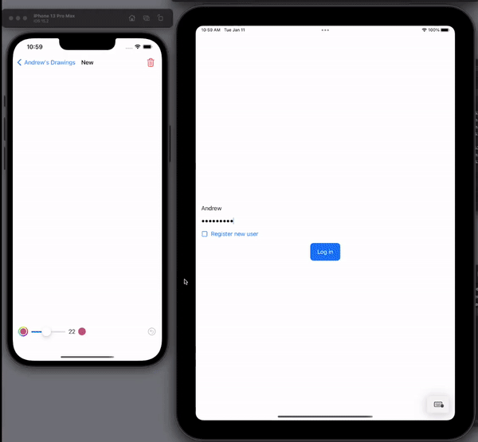

# Realm-Draw

Garden Draw is a drawing app that demonstrates the Realm mobile database and MongoDB Realm Sync can be used to draw a rough representation of my garden.

## Installation
- [Setup the Atlas App Services Backend](AtlasAppService)
- [Configure, build and run the iOS app](iOS)